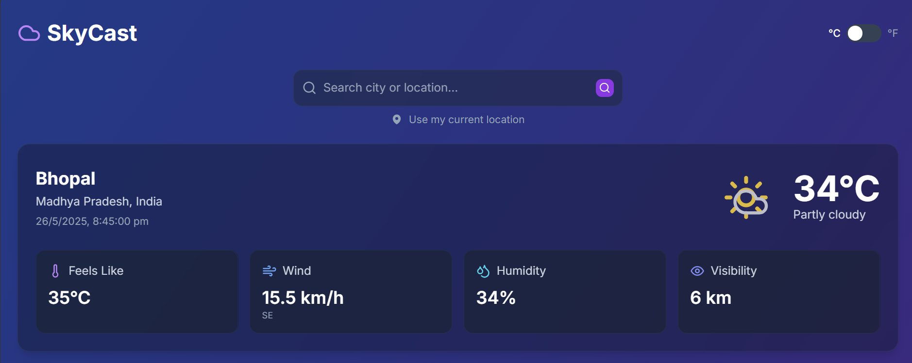
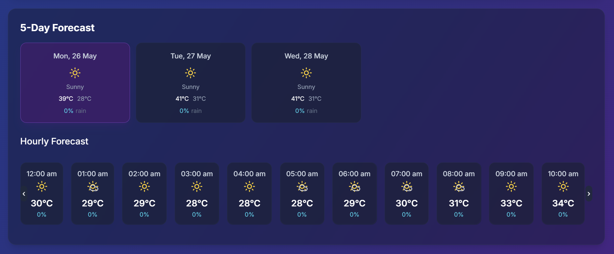
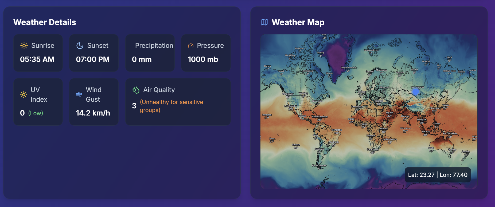
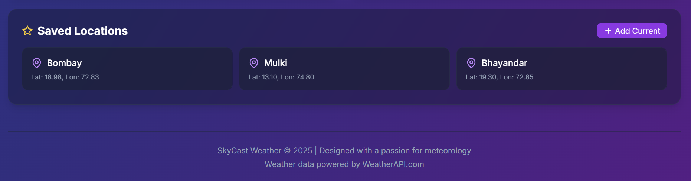

# SkyCast - Smart Weather Forecasting

**SkyCast Weather** is a visually stunning and feature-rich weather forecasting application designed to deliver accurate, real-time weather data with an immersive user experience. From current conditions to detailed forecasts and intuitive maps — it’s weather like you’ve never seen before.

---

## 🌟 Core Features

- **Real-Time Weather Data**: Instant insights on temperature, humidity, wind speed, and more.
- **5-Day Forecast with Hourly Details**: Plan ahead with detailed hourly breakdowns.
- **Smart Location Search**: Search any city or use geolocation to get weather for your current location.
- **Air Quality & UV Index**: Stay informed about air safety and sun exposure levels.
- **Weather Alerts**: Be notified of any extreme weather conditions.
- **Unit Toggle**: Switch effortlessly between °C and °F.
- **Saved Locations**: Favorite cities for quick access at any time.

---

## 🎨 Design & UI Highlights

- 🌑 **Dark Exotic Theme**: Rich gradients with deep purples and blues create an elegant nighttime aesthetic.
- 🌫️ **Glassmorphism UI**: Subtle blurs and translucency give the interface a sleek, modern feel.
- 🌤️ **Animated Weather Icons**: Lively and responsive icons reflect real-time conditions.
- 📱 **Fully Responsive Layout**: Optimized for seamless experience across desktop, tablet, and mobile.
- 🎨 **Dynamic Accents**: Weather-based colors shift to reflect the current atmosphere.
- 🔠 **Minimalist Typography**: Clean fonts with high contrast ensure readability.
- 🎞️ **Smooth Transitions**: Delightful micro-interactions and animations enrich user flow.

---

## 🚀 Tech Stack

- **TypeScript + Vite**
- **React & Tailwind CSS**
- **OpenWeatherMap API / Mapbox**
- **Geolocation API**

---

## 🌤️ App Preview

## 🖥️ Main Dashboard

<p align="center">
  
</p>

<p align="center"><em>Current temperature, location search, geolocation, and unit toggle (°C/°F)</em></p>

---

## 📅 5-Day & Hourly Forecast

<p align="center">
  
</p>

<p align="center"><em>Detailed forecast view with smooth scroll, visual indicators, and hourly breakdown</em></p>

---

## 🌍 Air Quality, Weather Details & Radar Map

<p align="center">
  
</p>

<p align="center"><em>Air quality index, UV levels, condition insights, and interactive radar view</em></p>

---

## ⭐ Save Locations for Quick Access

<p align="center">
  
</p>

<p align="center"><em>Bookmark and manage favorite cities for faster weather lookup</em></p>

---

## 🧭 Try it Live

👉 [Click here to explore SkyCast](https://nebula-weather.vercel.app/)

---

## 🛠️ Setup Instructions

````bash
git clone [https://github.com/Anish-Tripathi/SkyCast-Weather.git
cd SkyCast

To make SkyCast Weather work with your own data:

1. **Create a `.env` file** in the root of your project (same level as `package.json`).

2. **Add your API keys** to the `.env` file like this:

```env
VITE_WEATHER_API_KEY=your_openweather_api_key_here
VITE_MAPBOX_TOKEN=your_mapbox_access_token_here


npm install
npm run dev
````
